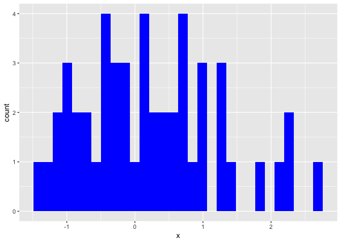
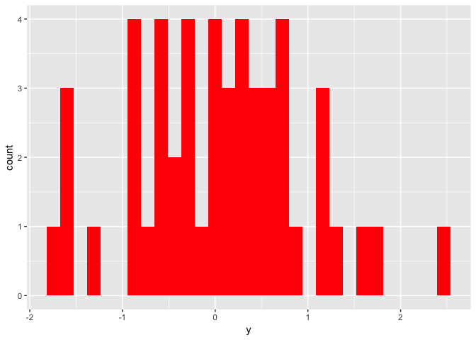
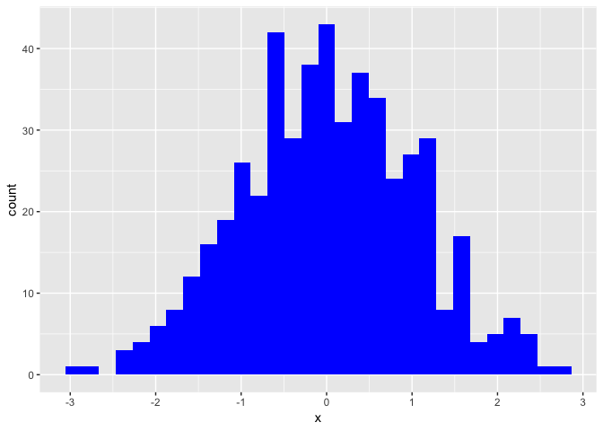
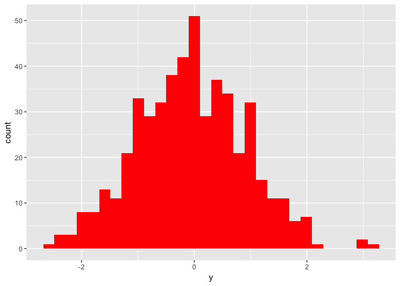

<!-- **The code to create this document in Rmarkdown can be downloaded by clicking the upper right-hand corner button that says `Code`.** -->

When doing long, identical analyses on different data sets or variables, it can be useful to have one function which outputs your analyses in an Rmarkdown friendly (ie., with headers) format.

This is a simple example of how multiple mini-analyses can be combined into one run-all function containing headers.

Let's say we have two separate data sets, `dat1` and `dat2`, and we want to look do two analyses on each data set.

1. Look at the distribution of each `x` and `y` variable
2. Run and report a regression model, `y` ~ `x`

We want the scientists who will read our report to be able to click on each sub-analysis in our table of contents.

Let's start by creating our data sets:


```r
library(ggplot2)
library(magrittr)
library(htmltools)

set.seed(7)
dat1 <- data.frame(x=rnorm(50),y=rnorm(50))
dat2 <- data.frame(x=rnorm(500),y=rnorm(500))
```

We can then make a few mini functions which will carry out each analysis.


```r
xDistFun <- function(dat){
  ggplot(dat, aes(x)) + geom_histogram(fill="blue")}

yDistFun <- function(dat){
  ggplot(dat, aes(y)) + geom_histogram(fill="red")}

xRegFun <- function(dat){
  lm(y ~ x, data=dat) %>% broom::tidy() %>% knitr::kable()}
```

Finally, we'll organize these mini functions into one function which will run all our analyses and nicely organize them into Rmarkdown friendly output.

Writing a function to return this output is non-intuitive, because it requires your tables and figures to be printed as-is, while your headers must to be converted to html script. This is achieved with the command `cat()` and a for loop.

Note: you cannot save the `cat`-ed version of your header, or `cat` it at all until you have reached the end of your function and you are ready to return/print all of your results. This is because `cat` immediately returns its output to the screen (and also does not save as an object).


```r
runManyFuns <- function(dat){
  # grab the name of our object for the main header
  title <- deparse(substitute(dat)) 
  # Name of our first subheader
  h1 <- "Distributions" 
  # list of two mini-analyses under subheader #1
  out1 <- list(xDistFun(dat = dat), yDistFun(dat = dat))
  # second subheader
  h2 <- "Regression Model"
  # second analysis
  out2 <- xRegFun(dat = dat) 
  # combine headers into one vector
  headers <- c(h1, h2) 
  # combine all output into a list to parse thru
  out <- list(out1, out2) 
  # makes our title header
  cat(paste0("\n#Data: ", title, "\n")) 
  for (i in 1:length(headers)){ 
    # parse through each element of our subheader vector
    cat(paste0("\n##", headers[i], "\n")) 
    # print each element of our output list
    print(out[i])
  }
}
```

This new function allows us to run and report our identical analyses on both `dat1` and `dat2` in a clean and concise way.

I have not yet figured out how to get rid of the [[1]] numbers signifying the elements of my list. I hope to utilize the `htmltools` package to get rid of these eventually.


```r
# Run same analysis on different data sets, outcomes, etc.
runManyFuns(dat1)
```

```
## 
## #Data: dat1
## 
## ##Distributions
## [[1]]
## [[1]][[1]]
```

<!-- -->

```
## 
## [[1]][[2]]
```

<!-- -->

```
## 
## 
## 
## ##Regression Model
## [[1]]
## 
## 
## term             estimate   std.error    statistic     p.value
## ------------  -----------  ----------  -----------  ----------
## (Intercept)     0.0602311   0.1322251    0.4555193   0.6507897
## x              -0.0902709   0.1287207   -0.7012929   0.4865065
```

```r
runManyFuns(dat2)
```

```
## 
## #Data: dat2
## 
## ##Distributions
## [[1]]
## [[1]][[1]]
```

<!-- -->

```
## 
## [[1]][[2]]
```

<!-- -->

```
## 
## 
## 
## ##Regression Model
## [[1]]
## 
## 
## term             estimate   std.error    statistic     p.value
## ------------  -----------  ----------  -----------  ----------
## (Intercept)    -0.0648102   0.0428622   -1.5120607   0.1311527
## x               0.0376818   0.0424069    0.8885765   0.3746597
```
